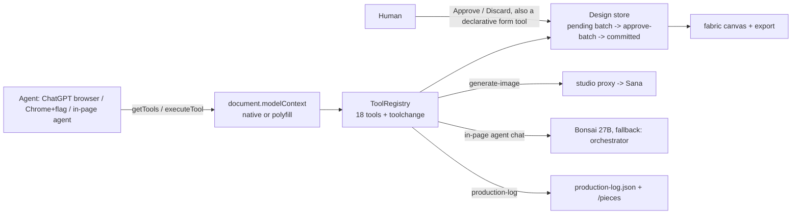

# WebMCP Design Studio

**An agent-native design studio — a person and an AI agent co-create flyers, posters
and social posts on a live canvas, through [WebMCP](https://github.com/webmachinelearning/webmcp).**

> Built for the [OpenAI WebMCP Challenge](https://webmcp.devpost.com/) — an app that
> becomes meaningfully better when people and their agents can use it together.

## What it does

The page registers its capabilities as in-page tools via
`document.modelContext.registerTool()` — tools like `create-design`, `add-text`,
`edit-element`, `generate-image`, `restyle-design`, `export-design`. Any WebMCP-capable
agent (ChatGPT's in-app browser, Chrome's agent, or the studio's own on-device agent)
discovers them, and then a human + agent can collaborate:

- the agent drafts, edits, restyles, generates images — every change lands as an
  **uncommitted batch** the human approves, edits, or undoes;
- `generate-image` runs **on-device via WebGPU** when the machine supports it (private,
  no server — images never leave the tab), falling back to a hosted service otherwise;
- the studio ships its own **in-page on-device agent** (Bonsai WebGPU LLM) so it works
  even without ChatGPT — and that agent speaks the same WebMCP protocol the browser
  agent does.

## Try it

Live: **https://studio.aitherium.com**

**In ChatGPT's browser, three lines:**
1. Open `https://studio.aitherium.com` in ChatGPT's in-app browser.
2. Say: *"make a spring yard sale flyer — Saturday 8am–2pm, 14 Orchard Lane, white background."*
3. Watch the tools fire in the protocol feed, then click **Approve batch** (or say "discard").

- **In ChatGPT**: open the URL in ChatGPT's in-app browser — WebMCP is supported out of
  the box. Ask the agent to "make a yard sale flyer, spring theme, white background".
- **In Chrome**: Chrome 149+ — open `chrome://flags/#enable-webmcp-testing`, enable
  the flag, restart, and load the URL (the flag is the contest's own requirement;
  the site also carries a spec-shaped WebMCP polyfill, so the in-page agent works
  everywhere with or without the flag).
- Then watch the tool list change live as the design state changes (`toolchange` events),
  and approve or undo each batch of edits.

## Develop

```bash
npm install
npm run dev      # local dev — includes a spec-shaped WebMCP polyfill so tools work
npm test         # vitest: spec rejection cases + the scripted judge flow
npm run build    # static export for GitHub Pages
```

## How it's built



- **WebMCP surface**: `src/webmcp/` — a typed registry over `document.modelContext`
  (with the `navigator.modelContext` pre-150 fallback), dynamic tool registration
  driven by design state, and a spec-shaped polyfill for dev/non-Chrome.
- **Canvas**: `src/canvas/` — fabric.js live canvas synced to a versioned design doc.
- **State**: `src/state/` — zustand store with the pending-batch model (approve/undo).
- **On-device agent**: `src/agent/` — Bonsai WebGPU LLM chat (runtime loaded from our CDN
  as an optional progressive layer; the app works without it).
- **Brand**: `src/brand/` — tokens from Aitherium's design system.

## Sign-off

Built with the Aitherium aw* stack — aither · awdk · awnode · awconnect ·
awnix · Claude Code on DeepSeek V4 Flash. No OpenAI APIs were touched in the
making of this infrastructure. For moral reasons.

## License

MIT — see [LICENSE](LICENSE).
